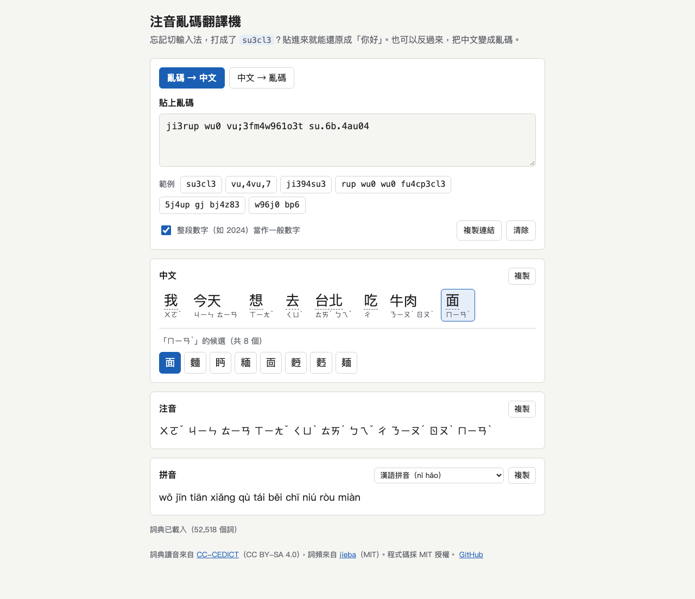

# 注音亂碼翻譯機
A static web tool that turns Zhuyin (Bopomofo) keyboard gibberish like `su3cl3` back into Chinese, and back again.

Demo：<https://useless-husband.github.io/zhuyin-decoder/>



## 是什麼

用注音輸入法時忘記切換，結果螢幕上出現 `su3cl3` 這種東西，是很多台灣人都遇過的事。
其實那串字母只是「你好」在標準大千（Daqian）注音鍵盤上的按鍵位置：`s` 是ㄋ、`u` 是ㄧ、`3` 是ˇ，`c` 是ㄏ、`l` 是ㄠ。

這個工具把亂碼還原成注音、拼音和中文候選字，也可以反過來，把中文轉成要按的鍵。
全部在瀏覽器裡執行，沒有後端、不會上傳你輸入的內容。

## 功能

- 鍵位轉注音：依大千鍵盤切成音節，輸出 `ㄋㄧˇ ㄏㄠˇ`。
  - 大小寫視為相同（Caps Lock 開著打出來的也能還原）。
  - 空白鍵是一聲；3、4、6、7 分別是 ˇ、ˋ、ˊ、˙。輕聲的 7 放在音節前或後都可以。
  - 空白、換行、標點、中文原樣保留；組不成合法音節的片段用紅色波浪底線標出來。
  - 整段都是數字（例如 `2024`、`3.14`）預設當一般數字，可以在畫面上關掉這個判斷。
- 注音轉拼音：漢語拼音（有聲調符號 `nǐ hǎo`，或數字聲調 `ni3 hao3`），也可選通用拼音。
- 注音轉中文：用最長詞匹配加詞頻排序，選出最可能的字詞；每一段都列出候選，點選就能替換。輸出繁體中文。
- 反向轉換：中文轉注音再轉鍵位，例如「你好」轉成 `su3cl3`。多音字取最常見的讀音，點字可以切換。
- 一鍵複製每一種結果、輸入時即時轉換。
- 網址帶參數可分享，例如 `?q=su3cl3`（`m=c` 是中文轉亂碼、`p=hanyu-num` 是拼音格式、`d=0` 是不把數字當一般數字）。
- 幾個常見範例按鈕、淺色與深色模式、手機寬度可用、可以只用鍵盤操作。

## 安裝與執行

需要的東西：電腦上有 Python 3 或 Node.js 其中一個就好（只是用來開本機網頁伺服器）。網頁本身沒有任何依賴，也不需要建置。

1. 下載專案，然後進到資料夾：

   ```sh
   git clone https://github.com/useless-husband/zhuyin-decoder.git
   cd zhuyin-decoder
   ```

2. 開一個本機伺服器（擇一）：

   ```sh
   python3 -m http.server 8000
   ```

   或

   ```sh
   npm run serve
   ```

3. 用瀏覽器打開 <http://localhost:8000/>。

為什麼不能直接雙擊 `index.html`？瀏覽器會擋下從 `file://` 載入的 ES module 和詞典檔，所以要透過伺服器開啟。

## 使用範例

在「亂碼 → 中文」輸入 `ji394su3`：

| 項目 | 結果 |
| --- | --- |
| 注音 | `ㄨㄛˇ ㄞˋ ㄋㄧˇ` |
| 漢語拼音 | `wǒ ài nǐ` |
| 中文 | 我愛你 |

輸入 `su3cl3, xsu3`（最後的 `x` 少了一個字母，組不成音節）：

| 項目 | 結果 |
| --- | --- |
| 注音 | `ㄋㄧˇ ㄏㄠˇ, xㄋㄧˇ`（`x` 會被標紅） |
| 數字聲調拼音 | `ni3 hao3, xni3` |
| 中文 | 你好, x你 |

在「中文 → 亂碼」輸入 `銀行你好`：

| 項目 | 結果 |
| --- | --- |
| 鍵位 | `up6c;6su3cl3` |
| 注音 | `ㄧㄣˊ ㄏㄤˊ ㄋㄧˇ ㄏㄠˇ` |
| 拼音 | `yín háng nǐ hǎo` |

「行」在「銀行」讀ㄏㄤˊ，程式是先用詞決定讀音，所以不用手動改。

也可以當函式庫用（Node 20 以上）：

```js
import { readFileSync } from 'node:fs';
import { parseDict } from './src/dict.js';
import { decodeKeys, piecesToChinese } from './src/convert.js';

const dict = parseDict(readFileSync('data/dict.txt', 'utf8'));
const result = decodeKeys('ji394su3', { dict });
console.log(result.zhuyin);                  // ㄨㄛˇ ㄞˋ ㄋㄧˇ
console.log(result.pinyin);                  // wǒ ài nǐ
console.log(piecesToChinese(result.pieces)); // 我愛你
```

## 專案結構

```
index.html            頁面
style.css             樣式（淺色／深色）
src/
  bopomofo.js         注音符號、聲調、大千鍵盤對照表
  pinyin.js           拼音與注音互轉、合法音節表
  keyboard.js         把亂碼切成注音音節
  dict.js             詞典載入、最長詞匹配、候選排序、中文轉注音
  convert.js          把上面幾個串成畫面用的函式
  examples.js         範例按鈕
  app.js              畫面邏輯（不含測試）
data/dict.txt         預處理過的詞典（約 1.4 MB）
scripts/build-dict.mjs 產生 data/dict.txt 的腳本
tests/                node --test 測試
.github/workflows/    CI
```

## 跑測試

需要 Node.js 20 以上，沒有任何套件要安裝：

```sh
npm test
```

目前共 60 多個測試，涵蓋：鍵位切音節與各種邊界（輕聲、ㄦ、單韻母、ㄓㄔㄕㄖㄗㄘㄙ 空韻、標點與數字）、拼音轉換規則（iou/uei/uen 縮寫、ü 規則、聲調符號位置）、全部合法音節的往返轉換、詞典排序、反向轉換與多音字，以及詞典建置腳本。

## 原理簡介

1. 鍵位切音節：把輸入的每個字元查大千鍵盤表得到注音符號，從左到右取最多三個符號（聲母、介音、韻母），由長到短檢查是不是合法音節（合法音節表是由約 400 個標準拼音音節轉換來的），後面必須接聲調鍵、空白，或是不屬於按鍵的字元。切不出來的字元標成「無法辨識」，之後從下一個字元重新開始切。
2. 注音轉拼音：拆成聲母、介音、韻母後查表；零聲母要改寫成 y、w（`ㄧㄡ` 變 `you`），有聲母時 `ㄧㄡ`、`ㄨㄟ`、`ㄨㄣ` 縮寫成 `iu`、`ui`、`un`，`ㄐㄑㄒ` 後的 `ㄩ` 寫成 `u`。聲調符號依序標在 a、e、ou 的 o，其餘標在最後一個母音。
3. 注音轉中文：詞典把「一串注音」對應到一組詞，權重愈大愈常用。對整串音節做動態規劃，找出「分成最少段」的切法，也就是最長詞匹配，段數一樣多時比詞頻總和。太冷僻的詞會多算一點成本，避免挑到怪詞。詞典裡是輕聲的詞（例如「謝謝」ㄒㄧㄝˋ ˙ㄒㄧㄝ），使用者常打成別的聲調，所以也接受，只是權重稍低。
4. 中文轉注音：對中文做最長詞匹配，用詞的讀音決定多音字怎麼唸；每個字另外保留單字的所有讀音，讓使用者切換。

### 詞典資料

`data/dict.txt` 是用 `scripts/build-dict.mjs` 從兩份公開資料預處理出來的：

- 詞條與讀音：[CC-CEDICT](https://cc-cedict.org/)，CC BY-SA 4.0。轉成注音；有 `Taiwan pr.` 標註的詞優先採用台灣讀音。
- 詞頻：[jieba](https://github.com/fxsjy/jieba) 的 `extra_dict/dict.txt.big`（繁體詞頻），MIT 授權。

多字詞只保留詞頻不低於 30 的；單字全部保留，多音字的主要讀音由含有該字的詞的詞頻統計決定，少數常見字（的、了、行、長⋯⋯）手動指定台灣的主要讀音。另外做了幾項台灣用字的微調：「裏」寫成「裡」、「臺」的詞同時提供「台」的寫法。

詞典是上述資料的衍生作品，依 CC BY-SA 4.0 授權散布；程式碼是 MIT。

重建詞典：

```sh
curl -L -o cedict.zip https://www.mdbg.net/chinese/export/cedict/cedict_1_0_ts_utf-8_mdbg.zip
unzip cedict.zip cedict_ts.u8
curl -L -o dict.txt.big https://raw.githubusercontent.com/fxsjy/jieba/master/extra_dict/dict.txt.big
node scripts/build-dict.mjs --cedict cedict_ts.u8 --freq dict.txt.big --out data/dict.txt --min-freq 30
```

（CC-CEDICT 每天更新，重建出來的檔案內容會和 repo 裡的略有不同。）

## 已知限制

- 只支援標準大千鍵盤；倚天、許氏等排列不支援。
- 選字只看單字與詞的詞頻，沒有考慮前後文，同音字有時要手動換（例如「餓」和「惡」）。
- 詞典來自 CC-CEDICT，缺少不少台灣口語詞和專有名詞；輕聲讀音也照 CEDICT，和台灣習慣可能不同（例如「喜歡」）。
- 本來就是英文單字的內容（例如 `hello`）沒有辦法判斷，可能被切成看起來合法的注音。
- 單獨的一兩個數字（例如 `5 ` 代表ㄓ）預設當數字，需要的話取消勾選「整段數字當作一般數字」。

## 授權

程式碼採 [MIT License](LICENSE)。`data/dict.txt` 依 CC BY-SA 4.0，來源見上方「詞典資料」。
